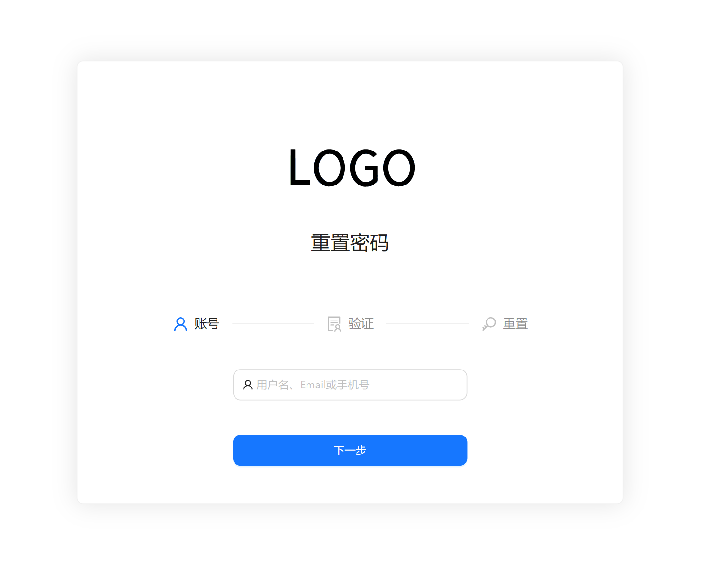
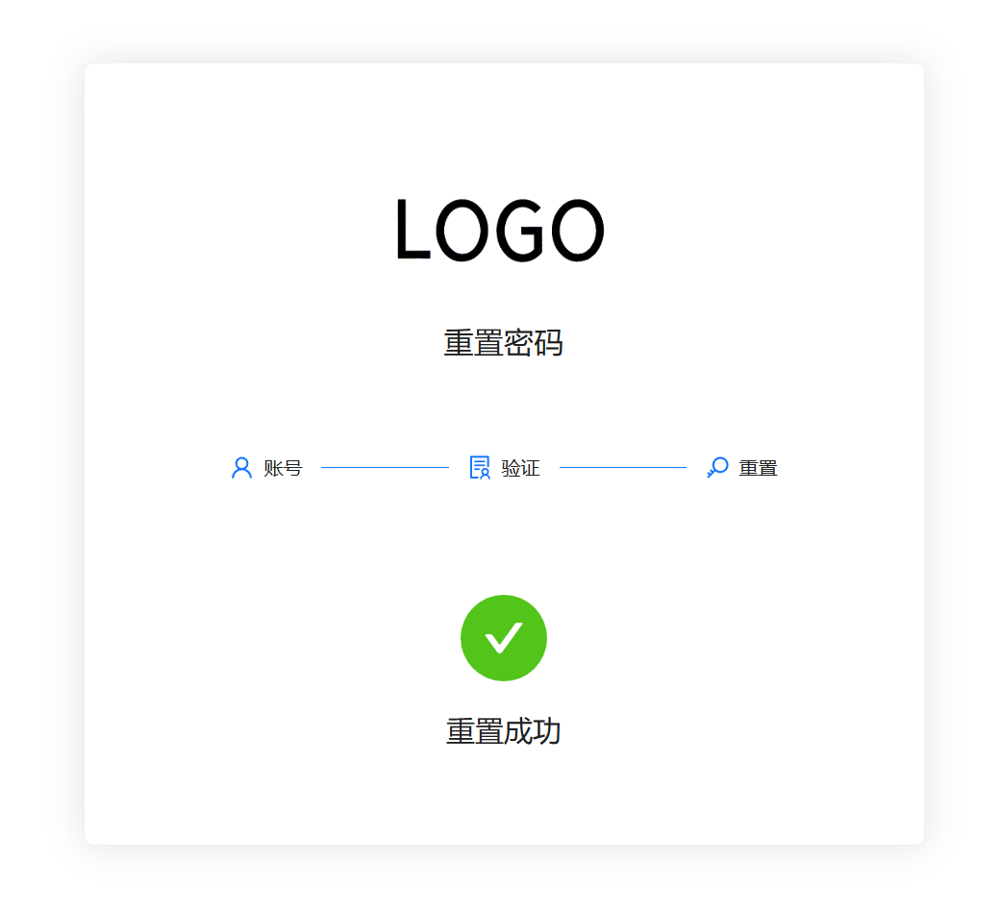
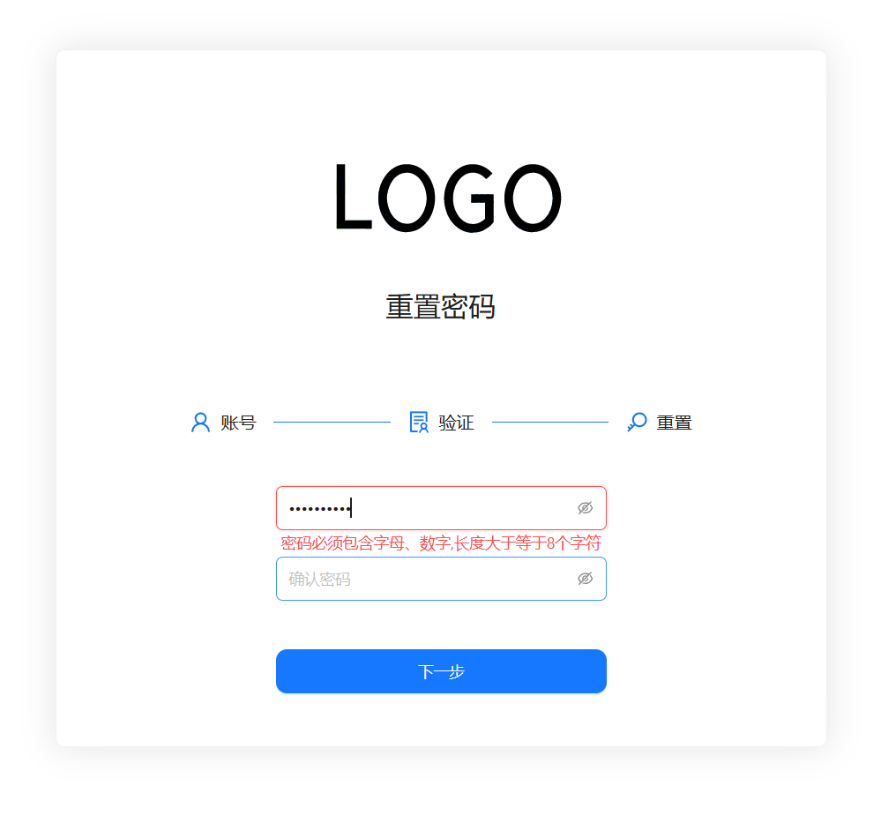
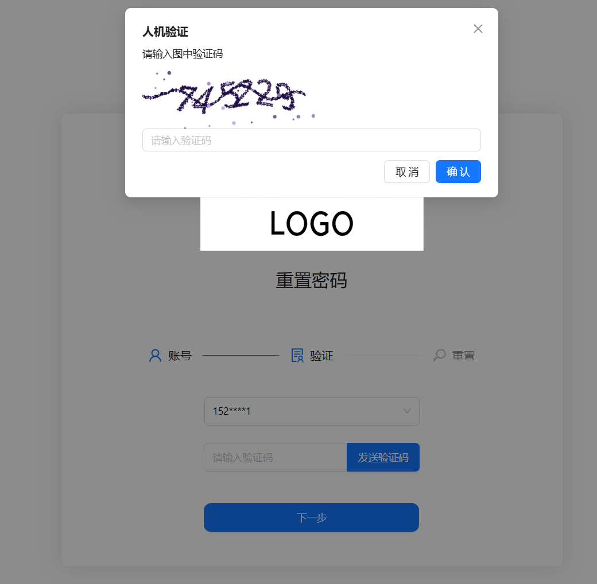

# LDAP密码重置

## 后端接口

公司项目，现在有新的项目取代它的，已弃用，经脱敏后开源

项目采用GoFrame + Vue3开发，为前后端分离设计，后端提供接口列表如下

| 接口                   | 请求方法 | 说明                   |
| :--------------------- | :------- | :--------------------- |
| /api/generate-captcha  | GET      | 创建图形验证码         |
| /api/get-user-info     | POST     | 得到用户的电话和邮箱   |
| /api/public-key        | GET      | 获取公钥，用于传输加密 |
| /api/reset-password    | POST     | 重置用户密码           |
| /api/send-code         | POST     | 发送短信或邮箱验证码   |
| /api/verification-code | POST     | 验证验证码             |

接口文档详情可以参见后端 ldappassresetbackend

邮箱验证码使用的是标准SMTP协议，短信服务对接的API为阿里云

## 操作流程

1. 输入用户名，可以是电话邮箱域用户名称，进行查找用户
2. 用户选择重置 验证方式，短信还行邮箱
3. 输入验证码，验证成功，输入新密码，完成重置

## 安全相关

为保证系统不被恶意利用，采取了以下安全措施

1. 所有接口不涉及任何敏感信息返回，如报错原因，采用Code码的形式判断问题
2. 查找用户信息时以打码的形式返回，如手机号，会被打码为152****1
3. 发送验证码时需要图形验证码，判断人机
4. 短信和邮箱验证码60秒冷却时间
5. 重置密码时采取非对称加密的形式传输数据
6. 后端二次验证密码复杂度
7. 验证码在重置后即自动失效，未重置有效期5分钟

## 前端速览

## 未来挖坑

可能会支持企微、钉钉认证协议，应用内认证免去验证码
